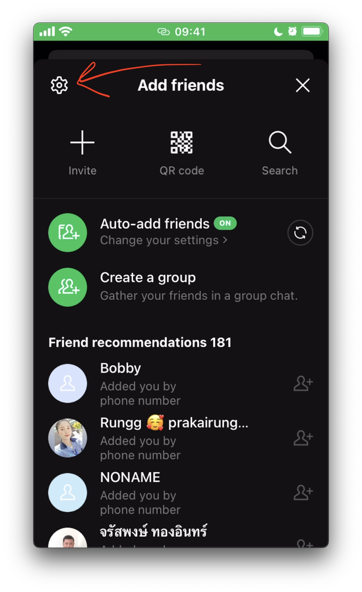
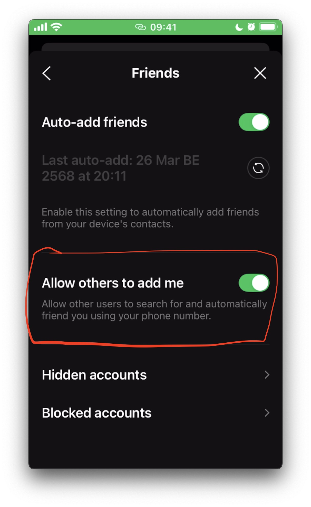

# [Line] วิธีตั้งค่าให้คนอื่นเพิ่มเพื่อนด้วยเบอร์โทร

แก้ปัญหาค้นหาเพื่อนด้วยเบอร์โทรไม่เจอ 
วิธีตั้งค่าคือ เราต้องไปเปิดสิทธิ์เพื่ออนุญาตให้คนอื่นค้นหาเราได้ ยกตัวอย่างระบบ IOS

1. กดปุ่มเพิ่มเพื่อน

2. กดปุ่มตั้งค่าด้านบนขาว

3. กดปุ่มเปิดใช้งานตามภาพ เท่านี้เพื่อนก็สามารถค้นหาเราเจอ

